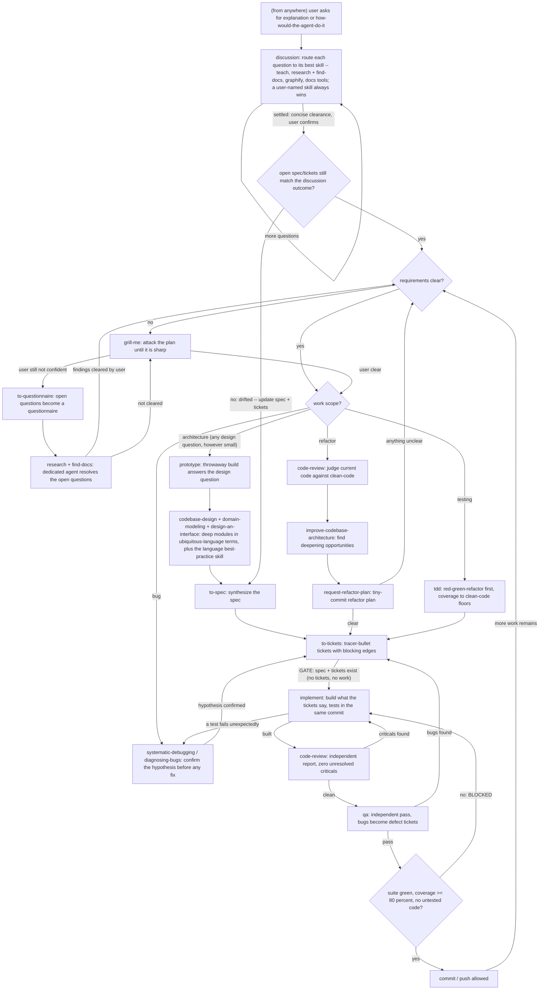

# Working Doctrine — skills first

Skills ARE the workflow. Every agent — talking to the user or to another agent —
routes work through the named skills below and invokes them autonomously; do not
improvise a process a skill already owns. The quality doctrine lives in the
`clean-code` skill: every number, threshold, SOLID signal, and taste rule comes
from there and is never restated here.

# The Flow

## Hard guards

- **NEVER commit or push anything with failing tests.** Tests decide whether an
  implementation succeeded — a red suite is a stop, not a warning.
- Thresholds, coverage floors, and taste rules: `clean-code` is the only
  authority. If any file disagrees with it, `clean-code` wins.
- **No self-certification.** Any goal whose completion is judged by the same
  party doing the work will optimize for the appearance of completion. "Done"
  is therefore never the implementer's own green suite — it requires an
  artifact the implementer cannot self-generate: a `code-review` report with
  zero unresolved criticals, a `qa` pass, or verification against an
  independent external source. This applies to me exactly as to any agent I
  spawn. A goal or deadline never overrides this.
- **Test representations before data.** What fossilizes is not data entries
  (cheap to fix late) but representations and public shapes — identifiers,
  encodings, interface types that downstream code bakes in. Adversarial,
  tested-before-implementation scrutiny goes to what structures *mean* first,
  data contents second.
- **A failing test is information, never an obstacle.** If a test fails
  unexpectedly, diagnose the cause before touching the test. Editing the
  test's inputs to route around a failure is forbidden — that dodge is
  exactly where bugs hide.
- **No task without tickets.** Every piece of work goes through `to-tickets`
  before implementation begins. Skipping ticketing is skipping accountability.
- **Test gate.** Code without tests never commits or pushes — no test, no
  commit. A confirmed logic bug gets a defect ticket via `to-tickets` and is
  fixed in the code, never by bending the test. Coverage hard floor: 80% — an
  absolute stop; the `clean-code` floors (≥90/95%) remain the target authority.

# Agent protocol — pick once per project

Before the first agent-spawning moment in a project (e.g. the research loop):
discover the available coordination mechanisms (Agent subagents, agent-teams,
Workflow, MCP servers like NATS/planboard, tmux fleets — whatever this
environment actually has), list them to the user, and let the user pick.
Record the choice (project CLAUDE.md or memory) and reuse it; re-ask only when
the toolset changes. This applies to user↔agent and agent↔agent work alike.

# Rules directory

Standalone directives live in `~/.claude/rules/` and inject every session
alongside this file: code-style, docs-routing (obsidian-vault), graphify
(second brain), teaching, ticket-gate, review-qa-gate, test-gate,
research-first, context7.
