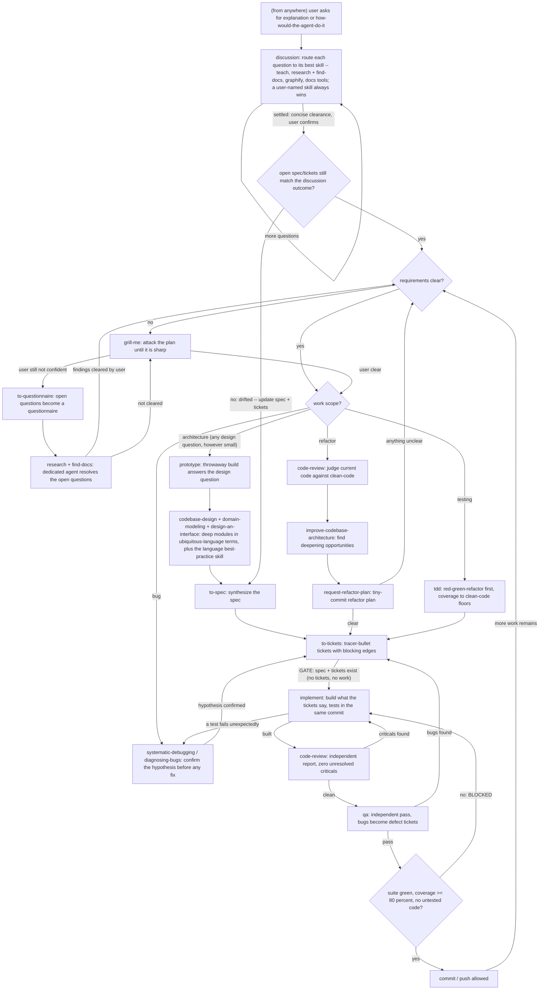

# Working Doctrine — skills first

Skills ARE the workflow. Every agent — talking to the user or to another agent —
routes work through the named skills below and invokes them autonomously; do not
improvise a process a skill already owns. The quality doctrine lives in the
`clean-code` skill: every number, threshold, SOLID signal, and taste rule comes
from there and is never restated here.

# The Flow

Guards, protocols, and standalone directives inject from `~/.claude/rules/`
(indexed in the README); the quality numbers live in the `clean-code` skill.
