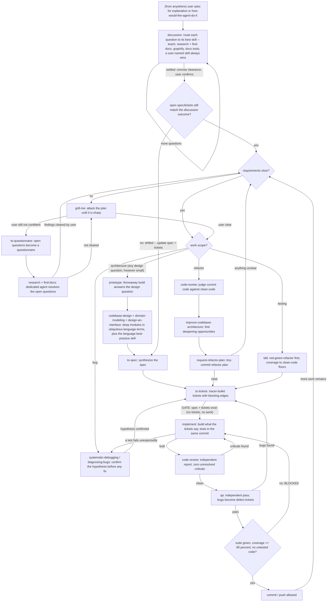

# Should the skill-routing doctrine be a graph instead of prose?

Research note, 2026-08-18. Question: would replacing the prose ROUTING in
`CLAUDE.md` (The Flow) with a machine-readable graph make agents follow the
flow more reliably — and if so, in which format?

## TL;DR

**Yes — express the routing as a Mermaid `flowchart TD` in a fenced
` ```mermaid ` block, and keep hard-guard rationale as prose.** Confidence:
moderate-to-high that it will not be worse and will improve next-step routing;
moderate on the size of the improvement for frontier Claude models.

- The only study that directly tests the exact scenario — a whole workflow
  handed to an LLM agent in-context, as text vs code vs Mermaid flowchart —
  found the Mermaid flowchart best at turn-level decisions (+5.6 to +10.7 pp
  tool-invocation F1 across GPT-3.5/4/4o), because models can "pinpoint the
  current state" (FlowBench, EMNLP 2024 Findings).
- Empirically (measured, not guessed): for identical routing content, Mermaid
  flowchart is the cheapest notation tested — fewer tokens than equivalent
  prose, roughly half of XML or JSON.
- Side benefits: the same block renders as a real diagram on GitHub and in the
  Obsidian vault, and a graph cannot hide a dangling route the way prose can.
- Ranked second: the same Mermaid fence wrapped in an XML tag pair — worth the
  ~15 extra tokens only in the `flow-reminder.md` hook echo (never rendered),
  not in `CLAUDE.md` (where the fence itself already delimits, and XML would
  complicate GitHub rendering).
- Rejected: JSON graph and XState-style JSON (~2x token cost, no rendering, no
  adherence evidence in their favor); LangGraph (not a notation at all — it is
  imperative Python).
- Key caveat: a graph in context is still advisory. The literature's biggest
  compliance wins come from external enforcement, and Anthropic states plainly
  that CLAUDE.md instructions are advisory while hooks are deterministic. The
  graph sharpens routing; the existing hook + rules-file gates remain the
  enforcement layer.

---

## Q1 — Do LLMs follow structured graph instructions more reliably than prose?

Evidence sorted by directness to the actual case (a routing workflow injected
as text into context, followed by the model itself, no external controller).

### Directly on point

**FlowBench** (Xiao et al., EMNLP 2024 Findings, arXiv:2406.14884) is the
closest existing experiment to this exact decision. It benchmarks LLM agents
given workflow knowledge in-context in three formats: "vanilla natural
language" text, "Python pseudo-code", and flowcharts in "Markdown Mermaid
notation" where "nodes correspond to distinct states" and "edges represent
possible movements between nodes" — 51 scenarios, 6 domains. Results:

| Turn-level tool-invocation F1 | Text | Code | Mermaid flowchart |
|---|---|---|---|
| GPT-4o | 69.1% | 69.0% | **75.5%** |
| GPT-4-Turbo | 62.9% | 67.0% | **73.6%** |
| GPT-3.5-Turbo | 59.8% | 57.9% | **65.4%** |

| Session-level success rate | Text | Code | Mermaid flowchart |
|---|---|---|---|
| GPT-4o | 41.7% | **43.2%** (code) | 42.7% |
| GPT-4-Turbo | **41.5%** | 37.8% | 40.6% |
| GPT-3.5-Turbo | **37.0%** | 31.3% | 34.9% |

The flowchart wins clearly at the turn level — "which action fires next",
which is precisely what a skill-routing doctrine decides — attributed to its
"organized and comprehensible nature, which enables LLMs to conveniently
pinpoint the current state for better planning." At the session level the
formats are roughly tied (text slightly ahead on two of three models). The
authors' overall conclusion: flowcharts achieve "the best trade-off among
performance, adaptability, and user-friendliness."
Honest reading: expect better per-decision routing, not a wholesale jump in
end-to-end outcomes.

**PLaG / AsyncHow** (Lin et al., ICML 2024, arXiv:2402.02805): adding an
explicit graph of the plan, as text, to an otherwise natural-language prompt
lifted GPT-4 from 65.7% (k-shot + CoT) to 73.0%, and to 77.7% when the model
builds the graph itself; GPT-3.5 from 22.6% to 29.0%. Also relevant: among
adjacency list, edge list, adjacency matrix, and CSR, "models have different
preferences" — no universal best serialization. Graphs help; the specific
encoding is secondary and model-dependent.

**Talk like a Graph** (Fatemi et al., ICLR 2024, arXiv:2310.04560): choice of
graph-to-text encoder changes graph-reasoning accuracy "by 4.8% to 61.8%,
depending on the task." Encoding choice is consequential, so it should be
picked on evidence (FlowBench's evidence is for Mermaid) rather than
aesthetics.

**Prompting with Pseudo-code Instructions** (Mishra et al., EMNLP 2023,
arXiv:2305.11790): pseudo-code task instructions beat natural-language
equivalents by 7-16 F1 points (absolute) on classification and 12-38%
relative ROUGE-L overall — on BLOOM and CodeGen, i.e. pre-frontier models, so
treat as directional: structured, branch-explicit instructions outperform
prose renditions of the same logic.

### Structure helps, but via scaffolding (weigh carefully)

These are frequently cited for "state machines work", but their gains come
partly from an external controller, which the CLAUDE.md case does not have:

- **StateFlow** (arXiv:2403.11322): +13 pp over ReAct on InterCode SQL at 5x
  lower cost, +28 pp on ALFWorld at 3x lower cost — but the model never sees
  the whole machine: "StateFlow employs a set of instructions T={T1,...,Ti} to
  guide the language model generation at different states", and an external
  transition function picks the next state. Evidence for decomposing work into
  states, not for in-context graph following.
- **SOP-Agent** (arXiv:2501.09316): SOPs written as "pseudocode-style
  Standard Operational Procedures... in natural language", represented as a
  decision graph — but a navigator performs DFS externally and shows the model
  only the current node's options.
- **FlowAgent** (arXiv:2502.14345): names the exact tension in this decision:
  rule-based workflow execution is rigid ("numerous transition edges" for one
  small flexibility), while prompt-based text workflows suffer compliance
  failures. Its PDL mixes natural language with pseudocode; ablations found
  its compliance controllers "indispensable". Lesson transferred: an
  in-context graph raises compliance but does not guarantee it — keep the
  deterministic gates (hook + rules) alongside.

### Adversarial evidence, weighed

**Let Me Speak Freely?** (arXiv:2408.02442) found "a significant decline in
LLMs reasoning abilities under format restrictions", and stricter constraints
degrade more. Critically, this is about constrained OUTPUT generation —
forcing the model to answer inside JSON/XML schemas — not about structured
INPUT. Reading a routing graph does not constrain the model's own generation,
so this result does not argue against a graph doctrine. Its residual lesson:
do not require agents to respond in a rigid format; the graph is something
they read, not a schema they must emit.

**Does Prompt Formatting Have Any Impact on LLM Performance?**
(arXiv:2411.10541, NAACL 2025 submission) — INPUT-side: the same content
reformatted (plain/Markdown/JSON/YAML) moved GPT-3.5-turbo performance by up
to 40% on code translation; GPT-4 was substantially more robust; no format
won universally. Two implications: format is not cosmetic, and the stronger
the model, the smaller the expected delta — so expect a modest, not dramatic,
uplift on frontier Claude models. (Generally, instruction adherence remains
brittle across the industry — a 256-model study, arXiv:2510.18892, tests
exactly this — which favors making routing maximally salient.)

### Anthropic official guidance (input structure, CLAUDE.md, skills)

- Prompt engineering: "XML tags help Claude parse complex prompts
  unambiguously, especially when your prompt mixes instructions, context,
  examples, and variable inputs... reduces misinterpretation." Use
  consistent, descriptive tag names; nest hierarchically. Also: "The
  formatting style used in your prompt may influence Claude's response style"
  — a mild side effect to know about.
- Claude Code best practices, on CLAUDE.md: "There's no required format for
  CLAUDE.md files, but keep it short and human-readable"; "Bloated CLAUDE.md
  files cause Claude to ignore your actual instructions!"; emphasis
  ("IMPORTANT", "YOU MUST") measurably improves adherence; and "Unlike
  CLAUDE.md instructions which are advisory, hooks are deterministic." So: no
  official mandate for any format — the binding constraints are brevity and
  clarity, and gates belong in hooks.
- Agent Skills authoring best practices: officially endorses explicit
  decision-point routing — the "Conditional workflow pattern: Guide Claude
  through decision points" ("Creating new content? -> Follow 'Creation
  workflow' below"), checklists for multi-step workflows, low degrees of
  freedom "when a specific sequence must be followed", and "Consistency helps
  Claude parse and follow instructions." A routing graph is this pattern in
  its densest form.

### Community practice

The most concrete published community practice ("CLAUDE.md Best Practices:
Mermaid for Workflows", dev.to/cleverhoods) converged on the same design this
research reaches independently: convert exactly the "First do X. If X passes,
do Y. If Y fails, do Z" content to Mermaid flowcharts, keep judgment and
rationale as prose ("The diagram captures the branch. The prose below it
captures the judgment"), and note the maintenance advantage: "You can't leave
a dangling arrow in a flowchart the way you can leave a stale sentence in a
paragraph." It cites FlowBench as its evidence base. A "3-6x token
efficiency" figure circulating in adjacent blog posts is NOT supported by
measurement — see Q2: for equivalent content Mermaid is about even with
prose, not 3-6x smaller.

**Q1 verdict:** for turn-level routing decisions — the doctrine's job — the
direct evidence (FlowBench) and the adjacent evidence (PLaG, pseudo-code
prompting, Talk like a Graph) all point the same way: an explicit in-context
graph beats prose. The honest limits: session-level outcomes were format-
neutral in FlowBench, effect sizes were measured on GPT-3.5/4-era models and
shrink as models get stronger, and no published study measures Claude
specifically.

---

## Q2 — Which format: Mermaid, XML, JSON, or Mermaid-in-XML?

### Adherence

- Mermaid flowchart is the only candidate with direct comparative evidence in
  its favor (FlowBench, above — its flowchart format IS "Markdown Mermaid
  notation"). It is also the de facto notation the literature standardized on
  for feeding flowcharts to LLMs.
- XML has official Anthropic backing for a different job: separating and
  labeling prompt SECTIONS. Nothing published shows XML-encoded graphs beat
  other graph encodings, and an XML element graph is not something Anthropic's
  guidance describes. XML and Mermaid are complements (wrapper vs content),
  not competitors.
- JSON graphs: no adherence evidence in their favor for this use;
  arXiv:2411.10541 shows JSON prompts sometimes win for some GPT models but
  results are model-dependent, and JSON carries the highest token cost (below).
- PLaG / Talk like a Graph caution that serialization preferences vary by
  model — a reason to prefer the notation with agent-workflow-specific
  evidence (Mermaid) over generic serializations (JSON/XML) with none.

### Token cost — measured, same 6-node / 9-edge routing graph in every format

Method: identical semantic content (6 skill nodes with one-line descriptions,
9 labeled routing edges) hand-written in each notation; counted with tiktoken
`cl100k_base` and `o200k_base`. Caveat: Claude's tokenizer is not public;
tiktoken is a proxy — the ORDERING is what matters and the gaps are large.

| Format | bytes | cl100k tokens | o200k tokens | vs Mermaid |
|---|---|---|---|---|
| Mermaid `flowchart TD` | 457 | **131** | **131** | 1.00x |
| Prose (same routing, sentences) | 651 | 137 | 137 | 1.05x |
| Mermaid `stateDiagram-v2` | 641 | 146 | 147 | 1.12x |
| Mermaid wrapped in XML tags | 499 | 145 | 147 | 1.11x |
| XML element graph | 833 | 239 | 239 | 1.82x |
| JSON graph (nodes + edges) | 885 | 266 | 266 | 2.03x |
| XState-style machine JSON | 942 | 259 | 265 | 1.99x |

Findings:

- Mermaid flowchart is the cheapest notation tested — slightly cheaper than
  equivalent prose and roughly half of XML/JSON. The syntactic overhead
  (arrows, brackets) is smaller than prose's connective tissue ("if", "then",
  "proceed to", "after that").
- The XML wrapper adds ~15 tokens — negligible, but unnecessary inside
  Markdown where the ` ```mermaid ` fence already delimits (and a fence is
  what GitHub/Obsidian render).
- Real-skeleton check: the full ~19-node draft below costs ~537 tokens
  (o200k) vs ~464 for the current CLAUDE.md Flow prose section it would
  replace. Near-neutral cost — and the graph makes ~27 edges explicit,
  including loop-backs and gate returns that the prose leaves implicit or
  delegates to other files. The win is precision per token, not compression.
- Against the circulating "3-6x better than prose" community claim: not
  reproduced. Equivalent content is about token-parity; claims of large
  savings compare a terse diagram against verbose prose that says more.

### Side benefits (verified)

- GitHub: "Diagram rendering is available in GitHub Issues, GitHub
  Discussions, pull requests, wikis, and Markdown files" — the doctrine
  mirror at `~/Personal/claude-config` renders as an actual flowchart.
- Obsidian: "To add a Mermaid diagram, create a `mermaid` code block" — any
  vault note quoting the flow renders it natively.
- Mermaid grammar fits the decided shape exactly: decision nodes `A{...}`,
  free-form quoted edge labels (`A -- "question? answer" --> B`), `%%`
  comments, subgraphs for grouping; labels accept Markdown and Unicode.

**Q2 verdict:** Mermaid flowchart on both adherence evidence and token cost;
`stateDiagram-v2` is a legitimate runner-up (native transition-label
semantics) but costs ~12% more tokens, has composite-state restrictions, and
FlowBench's evidence is for flowchart-style diagrams. XML/JSON graphs lose on
both axes. Mermaid-in-XML is sensible only where the text is injected outside
Markdown rendering (the hook echo) and even there optional.

---

## Q3 — Build vs adopt

The artifact is injected TEXT read by an LLM, never executed — so candidates
are judged as notation only.

- **Mermaid grammar (adopt)** — mermaid.js.org's flowchart syntax is a pure,
  stable, widely known text notation: no runtime required to be meaningful,
  renderers everywhere (GitHub, Obsidian), decision nodes and labeled edges
  built for exactly this, comments for annotations. It is also what the
  workflow-agent literature (FlowBench) standardized on. Adopt the grammar;
  nothing else from the ecosystem is needed.
- **XState machine JSON (reject)** — the config is "JSON-serializable" by
  design, but XState "is primarily a runtime library": semantics live in
  `setup()` implementations referenced by string identifiers, event-name keys
  force routing questions into identifier-shaped event names, and the JSON
  class costs ~2x Mermaid. As notation it buys nothing.
- **LangGraph (reject)** — graphs are built imperatively in Python
  (`add_node` / `add_edge` / `add_conditional_edges`; "nodes do the work,
  edges tell what to do next"); the docs describe no declarative text
  serialization of graph topology intended for LLM reading. Not a notation.
- **Emerging agent-workflow grammars (monitor, do not adopt)** — SOP-Agent's
  pseudocode SOPs and FlowAgent's PDL (YAML-ish node definitions + natural
  language/pseudocode procedure) are bespoke, framework-bound, and designed
  for controller-mediated execution. Nothing has crystallized into a portable
  standard worth adopting for a 20-node injected doctrine.
- **Hand-writing (yes)** — at ~20 nodes, tooling is overhead. The graph is
  small enough to review by eye, and GitHub's renderer doubles as the
  correctness check: if it renders, the syntax parses, and every dangling
  reference is visible.

**Q3 verdict:** adopt the Mermaid grammar as notation; hand-write and
hand-maintain the graph. No library, no schema, no generator.

---

## Q4 — Synthesis and recommendation

**Recommendation (ranked):**

1. **Mermaid `flowchart TD` in a fenced block, replacing (not supplementing)
   the routing prose of The Flow in `CLAUDE.md`.** Skills as nodes with
   one-line descriptions; edges carry the routing questions; the four gates
   ride on the edges they block (ticket gate on entry to `implement`,
   review-qa gate between `implement` and commit, test gate as the final
   diamond before commit, failing-tests as a mandatory edge back into
   debugging). Hard-guard RATIONALE (why no self-certification, why
   representations before data, clean-code authority) stays prose below the
   graph, exactly as today. Since CLAUDE.md reaches subagents too, the graph
   propagates to every agent automatically.
2. **The same graph, optionally XML-wrapped, in `flow-reminder.md`** — the
   hook fires only for the main agent and is never rendered, so a
   `<flow-graph>` wrapper is acceptable there per Anthropic's
   section-delimiting guidance; keeping the reminder byte-identical to the
   CLAUDE.md fence is the simpler, single-source option and what I would do.

**Confidence: moderate-to-high** that the swap is net-positive: direct
benchmark evidence favors exactly this format for exactly this job, measured
token cost is neutral-to-better, official guidance is format-agnostic but
pro-structure and pro-brevity, and the failure mode of prose (a stale
sentence, an implicit loop) is structurally impossible in a rendered graph.
**Moderate confidence on effect size**: gains were measured on GPT-3.5/4-era
models; format sensitivity shrinks as models strengthen, and FlowBench's
session-level parity says the graph sharpens individual routing decisions
more than it changes end-to-end outcomes.

**Caveats:**

- The graph remains advisory. Anthropic: CLAUDE.md instructions are advisory;
  hooks are deterministic. Keep the UserPromptSubmit hook and the
  rules-directory gates; the graph replaces prose ROUTING, not enforcement.
- Brevity is the binding constraint ("Bloated CLAUDE.md files cause Claude to
  ignore your actual instructions!"). The swap must delete the prose it
  replaces; adding the graph on top of the prose is the one clearly wrong
  move.
- Do not push judgment into edge labels. Edges carry routing questions;
  rationale, thresholds, and taste stay in prose and in `clean-code`
  (matches FlowAgent's rigidity warning and the community hybrid pattern).
- Token counts used tiktoken as a proxy for Claude's tokenizer; orderings are
  robust, exact numbers are approximate.
- No published Claude-specific measurement exists. Per Anthropic's own
  method, verify behaviorally: run the same ambiguous prompts before and
  after the swap and watch whether routing (grill-first, ticket gate, review
  gate) actually improves; revert if it does not.

---

## Draft skeleton — The Flow as a Mermaid flowchart

Derived from `CLAUDE.md` (The Flow + gates). 19 nodes, ~537 tokens (o200k
proxy) vs ~464 for the prose it replaces. Hard-guard rationale is
deliberately NOT in the graph.



Amendment (user, 2026-08-18, post-clearance): discussion / clearance /
drift-check nodes added — long explanation discussions route per-question to
skills, end in a concise clearance, and always re-verify open spec/tickets
for drift before work resumes. 22 nodes total.

What stays prose beneath the graph (unchanged from today): the skills-first
preamble; clean-code as sole quality authority; the no-self-certification
rationale; test-representations-before-data; the failing-test-is-information
rule; the agent protocol; the rules-directory listing. The four gates appear
in the graph only as the edges they block — their rationale does not.

---

## Sources

Academic (primary):

- FlowBench: Revisiting and Benchmarking Workflow-Guided Planning for
  LLM-based Agents — https://arxiv.org/abs/2406.14884 /
  https://aclanthology.org/2024.findings-emnlp.638/ (format definitions,
  per-format tables, "pinpoint the current state", trade-off conclusion)
- Graph-enhanced Large Language Models in Asynchronous Plan Reasoning (PLaG)
  — https://arxiv.org/abs/2402.02805 /
  https://proceedings.mlr.press/v235/lin24k.html (explicit-graph gains,
  encoding preferences vary by model)
- Talk like a Graph: Encoding Graphs for Large Language Models —
  https://arxiv.org/abs/2310.04560 (encoder choice: 4.8%-61.8% swing)
- Prompting with Pseudo-Code Instructions —
  https://arxiv.org/abs/2305.11790 /
  https://aclanthology.org/2023.emnlp-main.939/ (+7-16 F1 abs, 12-38% rel)
- Does Prompt Formatting Have Any Impact on LLM Performance? —
  https://arxiv.org/abs/2411.10541 (input format: up to 40% swing on
  GPT-3.5; GPT-4 more robust)
- Let Me Speak Freely? A Study on the Impact of Format Restrictions —
  https://arxiv.org/abs/2408.02442 (OUTPUT-side degradation; not
  input-side)
- StateFlow: Enhancing LLM Task-Solving through State-Driven Workflows —
  https://arxiv.org/abs/2403.11322 (per-state instructions, external
  transition function, +13/+28 pp vs ReAct)
- SOP-Agent: Empower General Purpose AI Agent with Domain-Specific SOPs —
  https://arxiv.org/abs/2501.09316 (decision-graph SOPs, navigator-mediated
  traversal)
- FlowAgent: Achieving Compliance and Flexibility for Workflow Agents —
  https://arxiv.org/abs/2502.14345 (rigid-vs-loose trade-off, PDL,
  controllers indispensable)
- When Models Can't Follow: Testing Instruction Adherence Across 256 LLMs —
  https://arxiv.org/abs/2510.18892 (adherence brittleness, context)

Anthropic (first-party):

- Prompting best practices (XML tag guidance) —
  https://platform.claude.com/docs/en/build-with-claude/prompt-engineering/claude-prompting-best-practices
- Claude Code best practices (CLAUDE.md format, brevity, emphasis, hooks
  deterministic vs advisory) — https://code.claude.com/docs/en/best-practices
- Agent Skills authoring best practices (conditional workflow pattern,
  checklists, degrees of freedom, consistency) —
  https://platform.claude.com/docs/en/agents-and-tools/agent-skills/best-practices

Format specifications and renderers (first-party):

- Mermaid flowchart syntax — https://mermaid.js.org/syntax/flowchart.html
- Mermaid state diagram syntax — https://mermaid.js.org/syntax/stateDiagram.html
- GitHub: Creating diagrams (native Mermaid rendering) —
  https://docs.github.com/en/get-started/writing-on-github/working-with-advanced-formatting/creating-diagrams
- Obsidian: Advanced formatting syntax (native Mermaid rendering) —
  https://obsidian.md/help/Editing+and+formatting/Advanced+formatting+syntax
- XState: Machines (JSON-serializable config, runtime library) —
  https://stately.ai/docs/machines
- LangGraph: Graph API (imperative construction, no text serialization) —
  https://docs.langchain.com/oss/python/langgraph/graph-api

Community practice:

- CLAUDE.md Best Practices: Mermaid for Workflows —
  https://dev.to/cleverhoods/claudemd-best-practices-mermaid-for-workflows-khb

Empirical token measurements: performed for this note, 2026-08-18, tiktoken
cl100k_base and o200k_base on semantically identical 6-node/9-edge graphs in
seven formats, plus the full draft skeleton vs the current Flow prose
section. Numbers in Q2.
